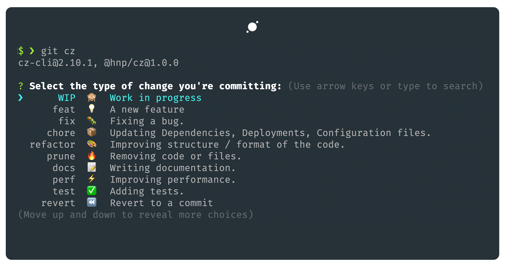

# @hnp/cz



> Commitizen Adaptor, fully compatible with angular style.

---

## Table of contents

-   [TLDR](#tldr)

-   [Installation](#installation)

-   [Usage](#usage)

    -   [Customization](#customization)

-   [Changelog](#changelog)

-   [License](#license)

## TLDR

Instead of `git commit` use `git cz` with `@hnp/cz` as the adaptor

## Installation

```sh
npm install @hnp/cz --save-dev
```

## Usage

If you havent already, install the [Commitizen Cli](commitizen/cz-cli) tools:

```bash
npm install commitizen -g
```

Initialize your project to use the adapter by typing:

```bash
commitizen init @hnp/cz
```

The command will initialize the adapter and add the following to your `package.json`

```json
{ "config": { "commitizen": { "path": "@hnp/cz" } } }
```

Now, can use `git cz` instead of `git commit`.

> Pro TIP: set as default adapter for your projects

```bash
npm install --global @hnp/cz && echo '{ "path": "@hnp/cz" }' > ~/.czrc
```

### Customization

You can customize the `scopes` on a project basis by adding a configuration section in your `package.json`:

```json
{ "config": { "scopes": ["home", "accounts", "ci"] } }
```

## Changelog

## License

[MIT](LICENSE) © [Jorge Proaño](https://www.hidden-node-problem.com)
